# Poultry Technician App Workflow

```mermaid
graph TD
    A[Sign In] --> B[Home Screen]
    B --> C[Navigation Bar]
    
    C --> D[Home]
    C --> E[Cycles]
    C --> F[Account]
    
    D --> B
    
    E --> E1[Start New Cycle]
    E --> E2[DOC Loading]
    E --> E3[Supply Delivery]
    E --> E4[Harvest]
    E --> E5[Reconciliation]
    E --> E6[Post-harvest]
    
    E1 --> E1A[Create cycle details]
    E1 --> E1B[Add to cycle list]
    
    E2 --> E2A[Record DOC delivery]
    E2 --> E2B[Add breed/group classifications]
    E2 --> E2C[Record rejections]
    E2 --> E2D[Record sample weights]
    E2 --> E2E[Submit loading records]
    
    E3 --> E3A[Record supply deliveries]
    E3 --> E3B[Add supply details]
    E3 --> E3C[Submit delivery records]
    E3 --> E3D[Resubmit if rejected]
    
    E4 --> E4A[Record harvest data]
    E4 --> E4B[Add remarks]
    E4 --> E4C[Mark final harvest]
    E4 --> E4D[Submit harvest reports]
    E4 --> E4E[Resubmit/delete entries]
    
    E5 --> E5A[Calculate mortality rate]
    E5 --> E5B[Calculate average live weight]
    E5 --> E5C[Calculate feed consumption ratio]
    E5 --> E5D[Save performance data]
    
    E6 --> E6A[Complete post-harvest checklist]
    E6 --> E6B[Mark cycle complete]
    E6 --> E6C[Lock grower data]
    
    F --> F1[Change Password]
    F --> F2[Sign Out]
    
    F1 --> F1A[Enter old password]
    F1 --> F1B[Enter new password]
    F1 --> F1C[Confirm new password]
    F1 --> F1D[Update credentials]
    
    F2 --> A

    style A fill:#e1f5fe
    style B fill:#f3e5f5
    style C fill:#e8f5e8
    style D fill:#e8f5e8
    style E fill:#e8f5e8
    style F fill:#e8f5e8
    style E1 fill:#fff3e0
    style E2 fill:#fff3e0
    style E3 fill:#fff3e0
    style E4 fill:#fff3e0
    style E5 fill:#fff3e0
    style E6 fill:#fff3e0
    style F1 fill:#fce4ec
    style F2 fill:#fce4ec
```

## Navigation Structure

The app follows a bottom tab navigation pattern with the following main sections:

1. **Home** - Dashboard overview
2. **Cycles** - Production cycle management
3. **Account** - Personal settings

## Cycles Management Flow

The Cycles section is the central workspace with a detailed workflow:

1. **Start New Cycle** - Create new production cycles
2. **DOC Loading** - Record Day-Old Chick delivery details
3. **Supply Delivery** - Track feed and medicine deliveries
4. **Harvest** - Record harvest data
5. **Reconciliation** - Finalize performance indicators
6. **Post-harvest** - Complete cycle closure tasks

## Account Management

Simple account management features:
- Change Password
- Sign Out

This workflow ensures technicians can efficiently manage all aspects of poultry production from start to finish while maintaining accurate data throughout the process.